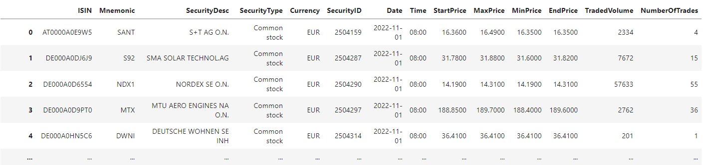

# ETLPipelinesCourseXetra
A repository containing a code created during the Udemy course: *"Writing production ready ETL pipelines with Python".*

This project gave me an opportunity to learn how to read and write to AWS S3 bucket with Python 
as well as enhanced my skills in writing clean and readable code. The important part of this project was to cover the
code with tests, including tests of reading and writing data to AWS using a mocked S3 bucket.

**Keywords**: Python, pandas, best practices, testing, AWS S3

## Running the code

Run this command to start the environment:

```commandline
pipenv shell
```

Now run this command to extract, transform and load the data:
```commandline
python run.py CONFIG_FILE
```

CONFIG_FILE is a configuration file written in YAML format.
Please check
`configs/xetra_report1_config.yml` to see an example config file.

## About the task and the data

The data used for this project was intended to be
[*Deutsche Börse Public Dataset*](https://registry.opendata.aws/deutsche-boerse-pds/):



According to the dataset documentation:
>The Deutsche Börse Public Data Set consists of trade data aggregated to one minute intervals from the Eurex and Xetra
> trading systems. It provides the initial price, lowest price, highest price, final price and volume for every minute 
> of the trading day, and for every tradeable security. 

Unfortunately, this dataset is no longer publicly available. To overcome this problem the course's lecturer provides a 
mocked dataset, with the same features as the original *Deutsche Börse*.

### Project's objective

The goal is to extract the data from AWS S3 bucket, aggregate data for each unique `ISIN`<sup>[1]</sup> and compute the values of:

* `opening_price`: it is the first StartPrice price of each unique `ISIN` per each day
* `closing_price`: it is the last EndPrice price of each unique `ISIN` per each day
* `min_price`: minimal price for each `ISIN` per day
* `max_price`: maximal price for each `ISIN` per day
* `daily_traded_valume`: sum of all volume per given day
* `change_prev_closing_%`: change in closing price between current day and the day before in %

After these transformations are done, they are loaded as a data frame in a parquet format to 
AWS S3 bucket at my personal account.
It also loads a meta file, which holds the dates of source data together with their time of processing.
This way, when the entrypoint job is run again only the unprocessed data is transformed.

---
1. A column name `ISIN` stands for *International Securities Identification Number* 
    (see the [wikipedia article](https://en.wikipedia.org/wiki/International_Securities_Identification_Number))

## About testing

To check what part of the code has been covered with tests run:
```commandline
coverage run --omit *tests/* -m pytest

coverage report -m
```

### Integration tests specification

Apart from unit tests I also implemented integration tests, which aims to test the whole pipeline.
Below there is integration tests specification:

| test name                       | test description                                     | test init                                                                    | input | expected ouput                                                      |
|---------------------------------|------------------------------------------------------|------------------------------------------------------------------------------|-------|---------------------------------------------------------------------|
| test_int_etl_report_no_metafile | Integration test for the main entrypoint etl_report1 | s3 source bucket with source content. Create S3BucketConnector test instance | -     | .parquet file on S3 with the source data content in report 1 format |

Currently, there is only one test provided, but I should add more in the future.

>**NOTE:** Before running the integration tests you have to create two buckets in your AWS S3: 
> one for source data and one for target data. For example:
> * piotr-xetra-integration-test-src
> * piotr-xetra-integration-test-trg

# Ideas for further improvement

1. Currently, I run the entrypoint job on my local machine.
The next step for this project would be to run this on some Kubernetes service.

2. Now there are no tools for visualizing transformed data. It would be nice to create an app, for example in Streamlit, 
    to visualize the data.

3. I could add more integration tests